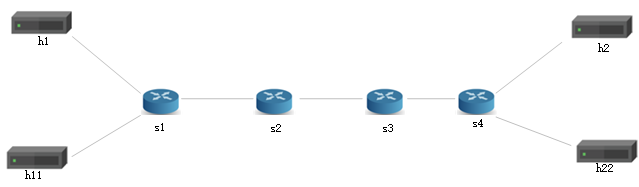

# Accurate ECN

## Introduction

This project is based on our published paper  "Accurate-ECN: An ECN Enhancement with Inband Network Telemetry"(https://ieeexplore.ieee.org/stamp/stamp.jsp?tp=&arnumber=9843273)
Accurate-ECN augment the TCP-ECN with INT to provide precise congestion information to the sender. For more information, please refer to the published paper.

## Prerequisites

- Install prerequisites (test with Ubuntu 20.04.3 LTS , Mininet 2.3.0, Python 3.8.10, Scapy 2.2.0)

## Step 1: Run Topology

Bring up a network in Mininet to test its behavior.

1. In your shell, run:
   ```bash
   make run
   ```
   This will:
   * compile `p4` file, and
   * start a Mininet 
   * The hosts are assigned IPs of `10.0.1.1`, `10.0.2.2`, etc (`10.0.<Switchid>.<hostID>`).
   * The control plane programs the P4 tables in each switch based on `sx-runtime.json`
   
2. We want to send a low rate traffic from `h1` to `h2` and a high rate iperf traffic from `h11` to `h22`.  The link between `s1` and `s2` is common between the flows and is a bottleneck because we reduced its bandwidth to 512kbps in `topology.json`. In this case the int packet will add. Therefore, if we capture packets at `h2`, we should see the right ECN value and no int packet.



3. You should now see a Mininet command prompt. Open four terminals for `h1`, `h11`, `h2`, `h22`, respectively:

  ```bash
  mininet> xterm h1 h11 h2 h22
  ```

4. In `h2`'s XTerm, start the server that captures packets:
   ```bash
   ./receive.py
   ```

5. in `h22`'s XTerm, start the iperf UDP server:
   ```bash
   iperf -s -u
   ```

6. In `h1`'s XTerm, send one packet per second to `h2` using send.py
  say for 30 seconds:

  ```bash
  ./send.py 10.0.2.2 "Accurate ECN" 30
  ```
  The message "Accurate ECN" should be received in `h2`'s xterm,

7. In `h11`'s XTerm, start iperf client sending for 15 seconds
   ```bash
   iperf -c 10.0.2.22 -t 15 -u
   ```

8. At `h2`, the `ipv4.tos` field (DiffServ+ECN) is always 1. When a node sends congestion, the `tcp.res` (int flag bit)field is 7.

9. Type `exit` to leave each xterm and the Mininet command line.
      Then, to stop mininet:

      ```bash
      make stop
      ```
      And to delete all pcaps, build files, and logs:
      ```bash
      make clean
      ```

## Step 2: Run Accurate ECN

Follow the instructions from Step 1. This time, when your message from `h1` is delivered to `h2`, you should see fine-grained network state.

To easily track the `tos` values you may want to redirect the output of `h2` to a file by running the following for `h2`
   ```bash
   ./receive.py > message.log
   ```
and message.log`  like this:
```
got a packet
###[ Ethernet ]### 
  dst       = 08:00:00:00:02:02
  src       = 08:00:00:00:02:02
  type      = IPv4
###[ IP ]### 
     version   = 4
     ihl       = 5
     tos       = 0x5f
     len       = 76
     id        = 1
     flags     = 
     frag      = 0
     ttl       = 60
     proto     = tcp
     chksum    = 0x674a
     src       = 10.0.1.1
     dst       = 10.0.2.2
     \options   \
###[ TCP ]### 
        sport     = 1234
        dport     = 4321
        seq       = 0
        ack       = 0
        dataofs   = 5
        reserved  = 7
        flags     = S
        window    = 8192
        chksum    = 0x6c4a
        urgptr    = 0
        options   = []
###[ INT ]### 
           type      = 1
           npt       = 0
           shimRsvd1 = 0
           length    = 0x1c
           shimRsvd2 = 0x0
           dscp      = 23
           shimRsvd3 = 0
           ver       = 2
           d         = 0
           e         = 0
           m         = 0
           rsvd1     = 0
           hopML     = 16
           count     = 1
           ins       = 0x0
           rsvd2     = 0x3500
           \metedata  \
            |###[ Metadata ]### 
            |  swid      = 1
            |  hop_latency= 1131403
            |  ingress_tstamp= 0x2
            |  egress_tstamp= 0xc
###[ Raw ]### 
              load      = 'cool'
```

